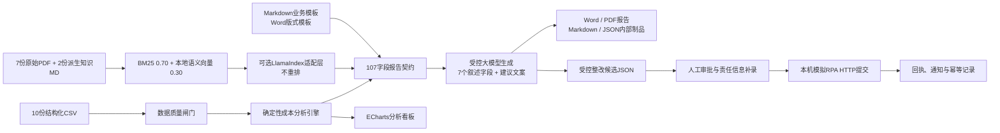
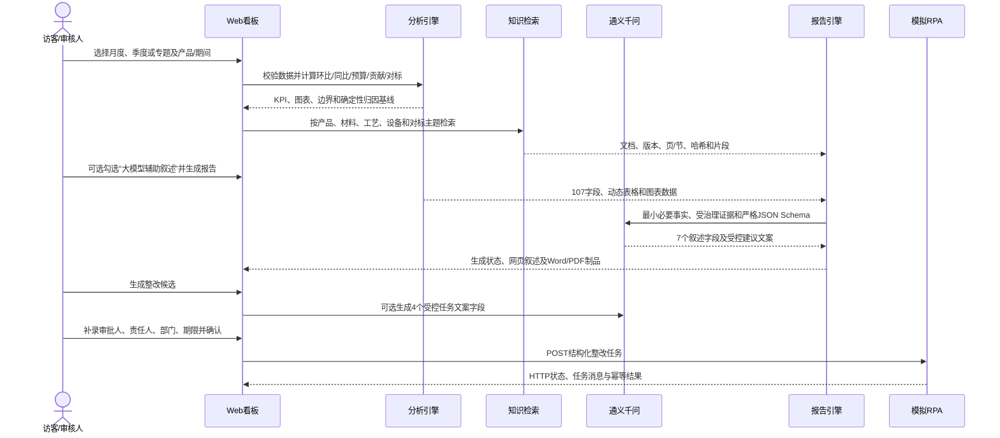

# 成本智能分析系统竞赛技术方案

> 版本：V1.7
> 更新日期：2026-09-01
> 适用范围：2026年第二届重庆市AI大模型创新应用大赛企业赛题原型

## 1. 建设目标与范围

系统面向制药企业成本分析，将结构化成本数据、行业行情、内部知识文档和报告模板组合为一条可审计、可回退的分析链路，输出交互式看板、Word/PDF报告及经人工确认后才能提交的整改任务。当前竞赛范围覆盖三个产品、2025年同期汇总、2026年1—6月实际/预算/人工工时、两厂同期对标和本机模拟RPA，并支持月度、季度和专题分析。

企业SSO、服务型数据库、真实企业RPA、真实企业微信和生产凭据不是赛题规定的运行前提。成本预测模型属于可选加分项；产品×月份×成本要素热力图已作为扩展能力实现，不再列为待开发项。

## 2. 总体架构

所有数值、比较方向、贡献度和告警均由确定性引擎计算。RAG只提供可引用的业务背景；大模型只能在受控Schema内改写叙述与建议，不能改动成本事实、动态表格、引用、报告标识或审批状态。网页面向访客只提供Word和PDF预览/下载，Markdown和JSON保留为审计与自动测试制品。

## 3. 核心处理流程

大模型未启用、无密钥、超时、限流、拒答、Schema不符或后置护栏失败时，报告和任务候选均自动回退到确定性文本，分析流程不中断。

## 4. 模块设计

| 模块 | 主要实现 | 职责与控制点 |
|---|---|---|
| 数据质量 | `app/data_quality/` | BOM/编码、字段、类型、月份、主键、必填值及0.01元实际/预算/人工跨文件勾稽；阻断错误时停止分析 |
| 成本分析 | `app/analysis/`、`app/dashboard/service.py` | 月度/季度环比、同比、预算偏差、人工指标、结构占比、两类贡献口径、市场变动、总成本桥接及两厂对标；专题复用同一事实口径 |
| 知识索引 | `app/knowledge/` | 文档解析、版本与哈希治理、BM25和本地TF-IDF/LSI语义向量融合、来源定位；可选LlamaIndex适配不重新召回或重排 |
| 报告契约 | `app/reporting/contract.py` | 汇总107个字段、补充字段、6张动态表、8类证据引用及生成状态 |
| 报告图表 | `app/reporting/charts.py` | 生成趋势图、单位成本瀑布图和本月成本结构图，作为高清图片嵌入Word并随LibreOffice转换进入PDF |
| 报告渲染 | `app/reporting/renderers.py`、`app/reporting/word_pdf.py` | 月度、季度、专题统一使用赛题Word模板；输出Word/PDF并保留Markdown/JSON审计制品 |
| 大模型控制 | `app/llm/` | 通义千问/OpenAI兼容调用、HTTPS、超时、有限重试、严格Schema、数字白名单、方向/因果/优先级护栏及确定性回退 |
| 主Web系统 | `app/dashboard/` | 单页面分析、当前阅读定位、ECharts趋势/瀑布/结构/热力图/成本驱动贡献图、人工分析、三步差异归因、报告生成进度、Word/PDF预览下载、整改审批和RPA回执 |
| RPA闭环 | `app/rpa/` | 受控任务候选JSON、状态转换、人工审批、接口载荷、幂等账本、HTTP重试及结果建模 |
| 批量与评测 | `app/batch/`、`scripts/competition_evaluation.py`、`scripts/run_llm_golden_evaluation.ps1` | 18个产品月份批量运行、三个赛题场景确定性验收和真实大模型黄金门禁 |
| 可选企业储备 | `app/review/` | 身份适配、SQLite审核工作台、签名执行和备份恢复；不阻塞竞赛主流程 |

### 4.1 Web信息架构与导航

主页面按照实际阅读路径固定为八个导航入口：成本分析、趋势图表、成本热力图、成本驱动、人工分析、差异归因、知识证据和整改闭环。滚动页面或点击导航时，左侧选中状态与右上角“当前阅读”提示使用同一导航目标同步更新。

- “本月/本季度/专题分析摘要”是分析结果的经营概览，不重复显示模块标签；
- “成本分析”集中展示单位成本、产量、总成本及三项成本要素的环比、同比和预算偏差；
- “趋势图表”使用统一浅色模块背景，容纳趋势、总成本变动贡献度、单位成本瀑布、总成本桥接和成本结构图；
- “成本驱动”独立展示原材料或制造费用明细表、明细贡献度图和可验证证据边界；
- “差异归因”是同一模块内的连续三步：对标差异总览、成本差异结构树、归因分析与改进建议；三步共享分析产品、期间、对标方向和受控证据；
- 页面不展示内部数据质量状态码、Markdown/JSON下载或内部规则文件名；数据校验、内部制品和边界规则仍在后台执行并保留审计记录。

## 5. 计算、检索与生成设计

### 5.1 确定性计算

- 单位成本＝总成本÷产量。
- 环比变动率＝（本月－上月）÷上月×100%。
- 赛题贡献度＝要素总成本变动额÷总成本变动额×100%，其中要素总成本＝要素单位成本×当期产量；单位成本变动辅助贡献仅用于瀑布与明细下钻并明确标注口径。
- 总成本桥接中，产量影响＝（本期产量－上期产量）×上期单位成本；单位成本影响＝本期产量×（本期单位成本－上期单位成本）。
- 两厂差异＝一厂－二厂；差异率＝差异÷二厂×100%；成本越低越有利，产量高低不单独评价为经营优劣。
- 告警条件为 `|环比变动率| > 10%`，恰好10%不触发。
- 内部保留完整精度，金额显示2位、数量0位、百分比2位。
- 同比使用2025同月/同季度，预算偏差使用2026预算，人工指标使用人工工时CSV。
- 实际采购量、实际采购价、标准工时、标准工资率、批次工艺收率及设备费用产品分摊没有完整输入时，价格差、用量差、标准效率差和设备事件成本影响一律不估算。

完整口径与零分母、负向变动、抵消和超过100%等边界见 `02_计算口径与边界规则.md`。

### 5.2 混合RAG与知识治理

正式索引V2.1由 `manifest.json`、`pages.jsonl` 和 `vectors.npz` 构成，共9份文档、137个知识块。除产品配方、生产工艺、设备、GMP原文/摘要外，已加入两份派生知识：

1. 同集团工厂对标基线：由中药二厂2025年和2026年1—6月成本汇总CSV构建，保留上游文件哈希和对标口径；
2. 历史成本异常处理记录：由设备维修历史、工艺文件和GMP偏差/收率规则构建，明确“已发生事件”和“通用核查规则”不得混写为因果。

正常模式使用BM25权重0.70、本地语义向量权重0.30；精确金额、设备号、工艺参数和法规条款由关键词覆盖率保护。检索结果携带文档名、版本、页/节、章节、内容哈希和权威级别。可选LlamaIndex `BaseRetriever`只把已验证命中转换为`NodeWithScore`，不改变原生召回与排序；异常时继续使用原生检索。

派生Markdown知识以章节标题作为引用位置，不把文档标题块计为“第1节”；同集团工厂对标基线优先命中当前产品与年份的数据章节。跨产品共页的工艺PDF在展示引用时按目标产品裁剪章节范围，避免把下一产品标题串入当前产品证据。市场价格与内部材料成本一侧或两侧持平时标记为“未形成相反方向”，不归入方向不一致。

### 5.3 报告Prompt、Schema与护栏

报告大模型请求只发送当前产品/期间的确定性结果、对标表、建议基线、Top知识证据和必要元数据。当前实际接入为阿里云百炼华北2，Base URL为 `https://dashscope.aliyuncs.com/compatible-mode/v1`，模型为 `qwen3.8-max`，使用OpenAI兼容Chat Completions和JSON Mode。

模型允许输出：

- 7个解释字段：波动告警描述、材料成本归因分析文本、成本异常排查分析、差异结构拆解分析、差异归因分析文本、本月亮点、需关注问题；
- 1—4条建议文案：序号、行动、责任部门、优先级、预期效果和“待业务审批”期限。

模型不得改变其余100个报告字段、补充字段、动态表格的成本事实、报告编号、模板/索引版本和证据引用。系统后置校验包括：字段集合与类型、长度、批准数字白名单、环比/同比方向、预算评价、建议数量与顺序、责任部门白名单、优先级不得降级、禁止采购/设备无依据因果、禁止声称任务已执行或绕过人工审批。任一校验失败即记录 `generation.status=fallback` 及原因并回退。

### 5.4 整改任务JSON控制

报告生成后可创建 `TaskCandidateBundle`。确定性代码保护任务ID、报告编号、契约哈希、产品、期间、来源字段、来源引用、事实发现、创建时间、状态和校验结果；大模型只可改写任务标题、整改建议、建议优先级和建议部门。候选始终从 `pending_review` 开始，只有人工填写审核人、责任人、部门、期限、通知方式并输入确认语句后，系统才生成 `RpaTaskCreateRequest`。提交目标被限制为本机 `127.0.0.1/localhost` 模拟RPA，并使用幂等键避免重复发送。

整改闭环汇总只展示“已形成候选、已人工确认、已模拟送达、发送失败”四项。统计来源是各报告目录中的 `task_candidates.json`、`reviewed_task.json` 和 `submission_result.json`，不把Word/PDF报告数量混入流程统计。正式启用或正式演示前，测试流程文件移至 `07_报告输出/测试流程归档/`，报告制品保留，四项流程统计从零开始；后续每次形成候选、审核和发送后按落盘状态递增。

### 5.5 模板、图表与期间边界

Markdown模板定义6章业务结构和107个占位符；Word模板定义封面、文档控制、阅读指南、目录、水印、正文、表格和字体版式。月度、季度和专题报告均映射到同一107字段契约和同一Word版式链路。

报告内嵌三类图表：单位成本趋势、单位成本变动瀑布和本月成本结构。图表先生成高清图片，再嵌入Word，并通过LibreOffice生成PDF。趋势标题严格跟随可得数据范围：只有完整6个月时显示“近6个月”；不足6个月时显示实际起止月份和点数，禁止补造缺失月份。

模板哈希、字段数量、缺失字段、未替换占位符、报告图表和PDF生成均纳入回归测试。

## 6. 主Web API合同

所有请求模型使用 `extra="forbid"`，出现未知字段、非法期间或缺少必选项时返回4xx，不静默忽略。

| 方法与路径 | 主要请求字段 | 关键响应字段与控制点 |
|---|---|---|
| `GET /health` | 无 | `status`、`data_quality`、`external_systems_required` |
| `GET /api/options` | 无 | 分析类型、产品、月份、季度、专题、数据质量及LLM/RAG可用状态 |
| `GET /api/heatmap` | 无 | 3产品×6月份×4成本要素的确定性事实及可选显示指标 |
| `POST /api/analyze` | `analysis_type`、`product`；月度用 `month`，季度用 `quarter`，专题用 `month+topic` | `meta`、`kpis`、`comparisons`、`trend`、`trend_context`、`cost_structure`、`waterfall`、`total_cost_contributions`、`total_cost_bridge`、`material_drivers`、`manufacturing_drivers`、`factory_benchmark`、`benchmark_tree`、`recommendations`、`alerts`、`narratives`、`evidence`、`unavailable_metrics`、`sources` |
| `POST /api/reports` | 分析选择字段＋`use_llm` | `report_id`、`report_number`、`analysis_type`、`period`、`generation`、`web_content`、预览和制品地址 |
| `GET /api/reports/{report_id}/preview` | 32位十六进制 `report_id` | 内联PDF；路径越界和清单不一致被阻断 |
| `GET /api/reports/{report_id}/download/{artifact}` | `artifact`为 `pdf/docx/md/json` | 返回对应制品；网页界面只展示PDF和Word入口 |
| `POST /api/workflows` | `report_id`、可选 `use_llm` | 确定性或受控大模型任务候选、生成状态和 `pending_review` 状态 |
| `GET /api/workflow-stats` | 无 | `generated_count`、`confirmed_count`、`delivered_count`、`failed_count`；仅统计整改流程文件，不统计报告数量 |
| `GET /api/workflows/{report_id}` | 报告ID | 候选、生成方式、审核、载荷和提交回执 |
| `POST /api/workflows/{report_id}/approve` | `candidate_id`、审核人、责任人、部门、角色、期限、优先级、通知方式、备注、确认语句 | 人工审核记录和受控RPA请求载荷 |
| `POST /api/workflows/{report_id}/submit` | 确认语句 | HTTP状态、远端状态、消息、请求/响应、幂等结果 |

“原材料涨价专项”设有事实准入：当前期间直接材料单位成本必须上升，且至少存在一项上升的材料明细或同名市场证据；不满足时返回4xx并提示改选材料上涨月份或“工厂成本差异专项”。整改任务表的主题与优先级继承首条受治理改进建议，责任人和截止时间仍保留到人工审批阶段填写。

## 7. 部署、密钥与安全

- Python最低版本为3.11；依赖版本范围固定在 `requirements.txt`。
- `启动演示系统.cmd` 调用 `scripts/start_demo.ps1`；首次运行自动创建项目级 `.venv` 并按 `requirements.txt` 安装依赖，随后执行失败即停的预检，再以隐藏进程启动Web与模拟RPA。启动器会验证旧进程记录与健康状态；默认 `8080/8090` 被其他程序占用时，自动在后续20组端口中选择同偏移的可用Web/RPA端口，并在窗口中输出实际 `Dashboard` 地址。
- 跨环境复现以根目录 `Dockerfile`、`compose.yaml` 和 `scripts/container_start.py` 为主路径。镜像固定Python 3.12、LibreOffice、Poppler和Noto CJK字体；Windows、macOS和Linux均通过Docker Compose启动同一套Web、报告渲染和模拟RPA链路。
- Web与模拟RPA均只监听 `127.0.0.1`，不会暴露到局域网。
- 竞赛交付采用“公开代码仓库＋评委本地一键启动＋5分钟端到端演示视频＋决赛现场本机演示”的访问模型，不提供匿名临时公网隧道。赛题并未要求持续在线的网址；公开仓库只承载代码、配置样例和说明，不承载API Key、运行日志、生成报告或受限赛题数据。
- `scripts/prepare_public_release.py` 从工作区确定性生成 `release/github-public/`，只复制自研源码、测试、容器文件和指定交付文档；`scripts/audit_public_release.py` 阻断受限目录、CSV/PDF/DOCX/数据库、真实密钥和本机绝对路径进入公开仓库。
- 正式企业部署不复用竞赛本地启动边界，必须另行配置固定域名、HTTPS、身份认证、服务器密钥管理、持久化存储、备份与访问审计后才可对外开放。
- 运行状态、PID和日志位于 `tmp/demo_runtime/`；停止脚本在终止前核对进程命令行，避免误杀同PID复用进程。
- 原始CSV、知识文档和模板只读；标准化、索引、报告、账本及评测结果写入独立输出层。
- 正式启用前的测试候选、审核记录和模拟RPA回执采用移动归档，不直接删除；归档后统计目录为空且报告Word/PDF仍保留。
- 通义千问API Key由当前Windows用户的DPAPI本地加密配置托管，启动时仅解密到子进程环境变量；密钥不得写入源码、报告、评测结果或日志。远程调用只发送当前任务所需的最小事实和证据片段。
- 未配置密钥或网络不可用时，确定性分析、看板、报告和RPA候选仍可运行，并清楚标记回退状态。
- 第三方组件及许可证见 `23_第三方依赖与许可证清单.md` 和根目录 `THIRD_PARTY_NOTICES.md`。

## 8. 验收基线与已知边界

截至2026-09-01：

- 项目实际运行环境的全量单元与集成回归为213/213通过；
- V1.2三个确定性黄金场景3/3通过，本机模拟RPA真实HTTP触发3/3成功；
- 2026-08-24重新实际调用通义千问的黄金门禁3/3通过，三场景成功率100%；
- LlamaIndex适配与原生检索的4组黄金查询来源、页码、哈希和顺序一致；
- 正式知识索引V2.1状态PASS，共9份文档、137个知识块；
- 月度、季度和专题均支持受控大模型报告、统一Word/PDF版式和图表嵌入；
- Web已覆盖六项核心成本指标、趋势/贡献/瀑布/总成本桥接/结构/热力图、人工分析、差异总览、结构树、归因建议、知识证据与整改闭环。
- Web导航、模块标签和“当前阅读”状态已统一；主要成本驱动拥有独立导航，差异总览、结构树与归因建议共享一个三步模块背景。
- 正式整改统计已完成测试记录归档，当前从0开始，历史测试报告制品未删除。
- 月度、季度、专题真实HTTP端到端验收3/3通过：分析、受控大模型报告、Word/PDF、候选生成、人工审批和模拟RPA送达均成功；受控大模型整改JSON同时覆盖大模型生成与确定性回退路径。
- 三类最终Word与PDF均为11页；经Word/WPS输出与全新LibreOffice重渲染逐页核对，封面七行定位、文档控制、阅读指南、目录、图表、斜向水印、整改表和知识引用无分页漂移。
- 当前报告生成器已将封面左下角信息稳定定位在“整体解决方案”下方七行处，并按最终11页正文重新校正目录页码；对应Word、PDF与网页在线预览已复核一致。
- Windows一键启动已完成真实端口冲突演练：默认 `8080/8090` 被占用时自动切换至 `8081/8091`，Web与模拟RPA健康检查均通过；重复启动可复用已登记且健康的本系统服务，停止脚本只关闭命令行与项目路径同时匹配的进程。

当前仍应显式披露以下数据边界：

1. 中药二厂只有汇总成本，没有原材料消耗明细，因此结构树叶子层不能计算两厂原材料明细差异；
2. 企业实际采购数量和采购单价未提供，不能计算采购量差/价差，也不能把市场行情写成企业采购原因；
3. 标准工时、标准工资率和批次工艺收率未提供，不能计算标准人工效率差、标准工资率差或量化收率成本影响；
4. 设备事件存在不等于已证明成本因果，缺少产品分摊依据时不得量化设备维修对单位成本的影响；
5. 2026年早期月份不足6个历史点时，趋势只能展示截至分析期的可得月份。

本次V1.7在V1.6受控生成与验收基线之上，补充了一键启动端口自动选择、旧进程健康复用与作用域停止逻辑，并固化报告封面七行定位和目录页码校正结果。真实端口冲突演练、213项全量回归、公开仓库审计及评委运行包预检均通过。后续修改数据、公式、Prompt、Schema、知识索引、报告契约、安全护栏、启动脚本或容器依赖后，仍必须重新执行对应门禁。
